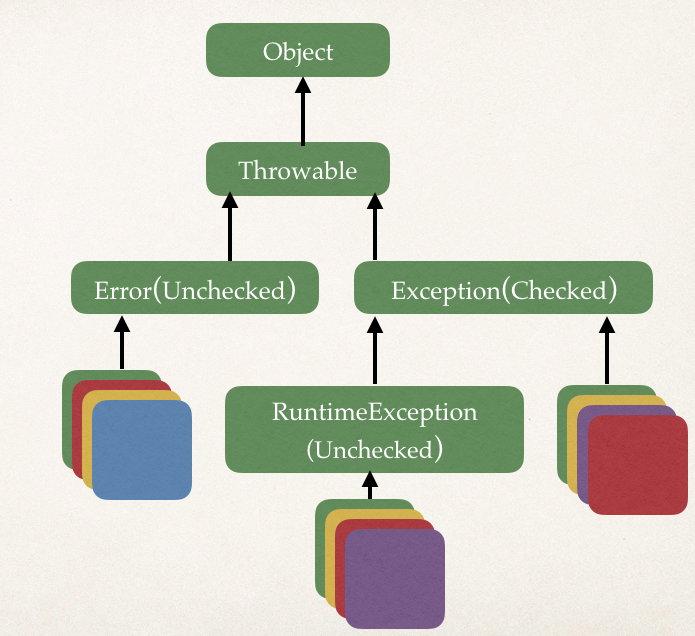

# Exception Handling



## Rules in Handling Exception : 

1. Exception, Error, RuntimeException and Thowable types can all be thrown using the **`throw`** keyword.

2. Always resist to write a single catchall exception 

```java
try {
//some code
} catch (Exception e){
}
```
3. Order of catching exceptions : **catch** bolck of subclasses will be used first, then parent exception class
```java
try{
} catch (FileNotFoundException e){
} catch (IOException e){
} catch (Exception e){
}
```
4. 
